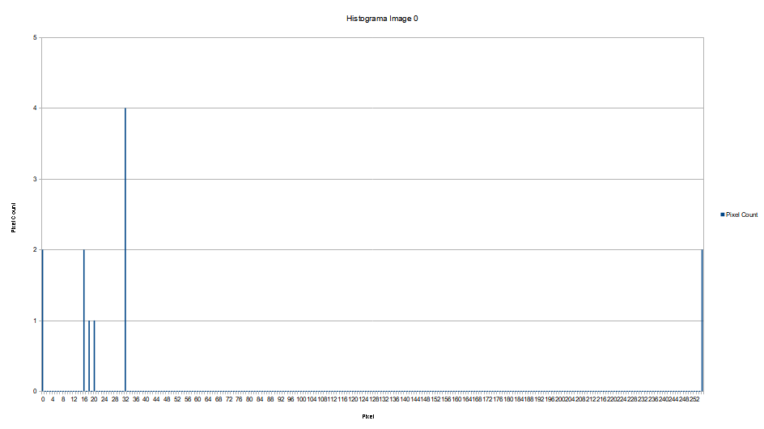
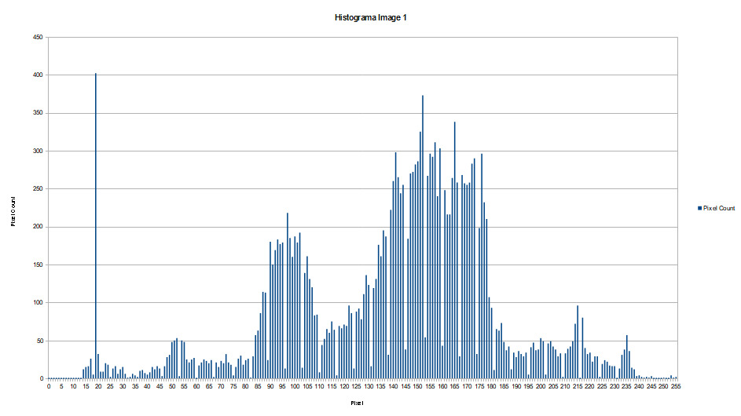

# ELF74 - Sistemas Embarcados
- Aluno: Anderson Luiz de Souza Kmetiuk
- Email: andersonkmetiuk@alunos.utfpr.edu.br

- Professor: Prof. Paulo Denis Garcez da Luz
- Email: garcez@professores.utfpr.edu.br

- Disciplina: ELF74 - Sistemas Embarcados
- Ano: 2022
- Semestre: 1

## Documentações
- Tiva C Series &rarr; TM4C1294NCPDT
  - [Datasheet](https://www.ti.com/lit/ds/symlink/tm4c1294ncpdt.pdf?ts=1687451818296)
  - [Cortex M3/M4F Instruction Set](https://www.ti.com/lit/ug/spmu159a/spmu159a.pdf)
  - [ARM and Thumb-2 Instruction Set - Quick Reference Card](https://developer.arm.com/documentation/qrc0001/latest/)
- IAR Embedded Workbench for ARM v9.20 &rarr; https://www.iar.com/products/architectures/arm/iar-embedded-workbench-for-arm/
- TivaWare C Series v2.2.0.295
  -  [Download](https://www.ti.com/tool/SW-TM4C)
  -  [TivaWare Peripheral Driver Library](https://www.ti.com/lit/ug/spmu298e/spmu298e.pdf?ts=1687399770541&ref_url=https%253A%252F%252Fwww.ti.com%252Ftool%252FSW-TM4C)
- ThreadX 
  - [Github Repo](https://github.com/azure-rtos/threadx)
  - [Documentation](https://docs.microsoft.com/en-us/azure/rtos/threadx/)
- Elevador
  - [Projeto SimSE32](https://pessoal.dainf.ct.utfpr.edu.br/douglasrenaux/index_files/Page392.htm)

## DevKit
- LEDs
  - PN1 &rarr; LED 1
  - PN0 &rarr; LED 2
  - PF4 &rarr; LED 3
  - PF0 &rarr; LED 4

- Switchs
  - PJ0 &rarr; SW1
  - PJ1 &rarr; SW2
 
## Lab 1
Configuração inicial da placa

## Lab 2
## Definição do problema
- Deve-se ler uma tecla: Tecla_1 (PJ0/USR_SW1) para iniciar a contagem do tempo e enquanto a Tecla_1 não for pressionada nada acontece.
- O disparo do “tempo de jogo” deve ser feito pela Tecla_2 (PJ1/USR_SW2) somente após ter sido dado início do jogo na Tecla_1.
- Caso o tempo exceda de 3s, travar o uso da segunda tecla: Tecla_2 e indicar que o jogo acabou acendendo o LED:D4 (PF0).
- O programa pode deve reiniciar todo o processo caso a Tecla_1 (PJ0/USR_SW1) seja pressionada novamente, mesmo estando no estado do “tempo de jogo”.
- A reposta do “tempo de jogo” deve ser fornecida em "ms".

## Fluxograma
<p align="center"> </p>

## Lab 3 - Histograma
Integração de Assembly com C.

## Domínio do problema
Um bitmap é composto por pixels dispostos na forma de uma matriz. Numa imagem em tons de cinza, cada pixel é representado por um valor numérico indicando o nível de luminosidade daquele pixel. Numa imagem em tons de cinza de 8-bits, cada pixel é representado por um valor de 8-bits, portanto de 0 (preto) até 255 (branco).

Um histograma é uma representação gráfica da distribuição de tons de uma imagem. O eixo horizontal apresenta os possíveis valores dos pixels (neste caso de 0 a 255) e o eixo vertical indica quantos pixels da imagem tem aquele valor.

## Definição do problema
Desenvolva uma função em assembly que constrói o histograma de uma imagem em tons de cinza com 8-bits por pixel.

### Parâmetros de entrada
- image width - número de pixels em uma linha da imagem.
- image height - altura da imagem em pixels.
- starting address - endereço do primeiro pixel da imagem.
- histogram - endereço inicial de um vetor de tamanho 256. Cada posição do vetor armazena um inteiro sem sinal de 16-bits. Este vetor não possui dados válidos quando a função é chamada. Ele é usado apenas para o retorno da função.

### Restrições
- O tamanho máximo da imagem é de 64K (65.536) pixels.
- A função retorna o valor 0 se o tamanho da imagem for superior a 64K.
 
### Retorno
- Inteiro sem sinal de 16 bits indicando o número de pixels processados.
- Saída em CSV (comma-separated values)
  - Como a tiva não tem suporte para arquivos os valores são gerados no console e são copiados manualmente para um arquivo .csv

### Prototipo da função
```
uint16_t EightBitHistogram(uint16_t width, uint16_t height, uint8_t * p_image, uint16_t * p_histogram);
```

### Exemplo de imagem (arquivo images.c)
```
const uint8_t image0[HEIGTH0][WIDTH0] = {
    { 20, 16, 16, 18}, {255, 255, 0, 0}, {32,32,32,32}
};
```
### Para realizar a integração do C com o Assembly utilizamos o seguinte trecho de código
```
; -------------------------------------------------------------------------------
        PUBLIC EightBitHistogram
        SECTION .text : CODE (2) 
        THUMB                        ; Instruções do tipo Thumb-2
; -------------------------------------------------------------------------------
        EXPORT EightBitHistogram ;exportar a função pro c
; -------------------------------------------------------------------------------
```
### Os parâmetros são armazenados nos seguintes registradores
- R0 &rarr; width
- R1 &rarr; height
- R2 &rarr; endereço/ponteiro da imagem
- R3 &rarr; endereço/ponteiro do histograma
    
### A Tiva C armazena o endereço de retorno em R4, por isso temos
```
  MOV R4, R3  
  BX LR
```
### Histograma de image0


### Histograma de image1


## Lab 4 - Comunicação Serial
## Contexto
A Comunicação Serial é muito utilizada para permitir aos microcontroladores um canal de envio e recepção de dados com outros dispositivos. Não é uma comunicação considerada de alta velocidade, quando se compara aos padrões SPI e Ethernet. Porém, é de fácil utilização e configuração de hardware.

## Definição do problema
Programar um protocolo serial simples, sem paridade, checksum, C.R.C. e criptografia. Este protocolo foi desenvolvido para comandar 04 x Relés na placa do Kit TIVA EK-TM4C1294XL. Simular os Relés nos 4 leds da placa: LED1 (PN1), LED2 (PN0), LED3 (PF4) e LED4 (PF0). O LED ligado significa Relé ligado e LED desligado significa Relé desligado. O programa deve ser no estilo “Super Loop”. Deve ficar em loop infinito sempre que receber um pacote válido na serial, deve atuar no hardware.

### Protocolo utilizado
|    #    |   Tipo    |   Número do LED   |   Estado (0: apagado / 1: ligado)    |
|:-------------:|:-------------:| :-------------:| :-------------:| 

|    Comando    |   Resposta    | Resultado |
|:-------------:|:-------------:| :-------------:|
|#R10|@R10| Desliga LED 1 |
|#R11|@R11| Liga LED 1 |
|#R20|@R20| Desliga LED 2 |
|#R21|@R21| Liga LED 2 |
|#R30|@R30| Desliga LED 3 |
|#R31|@R31| Liga LED 3 |
|#R40|@R40| Desliga LED 4 |
|#R41|@R41| Liga LED 4 |
|#RTX0|@TX0| Desliga tudo |
|#RTX1|@TX1| Liga tudo |
 
## Lab 5 - ThreadX
## Definição do problema
- Duas Threads: “TLed1” e “TLed2”;
- Na TLed1 construir um código simples para que o Led1 da placa pisque a 1s.
- Na TLed2 construir um código simples para que o Led2 da placa pisque a 2s.
